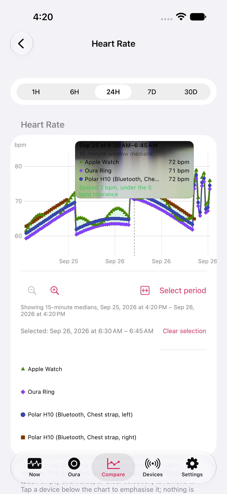
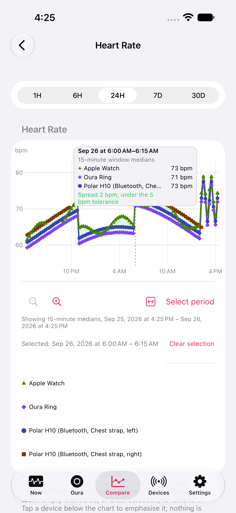
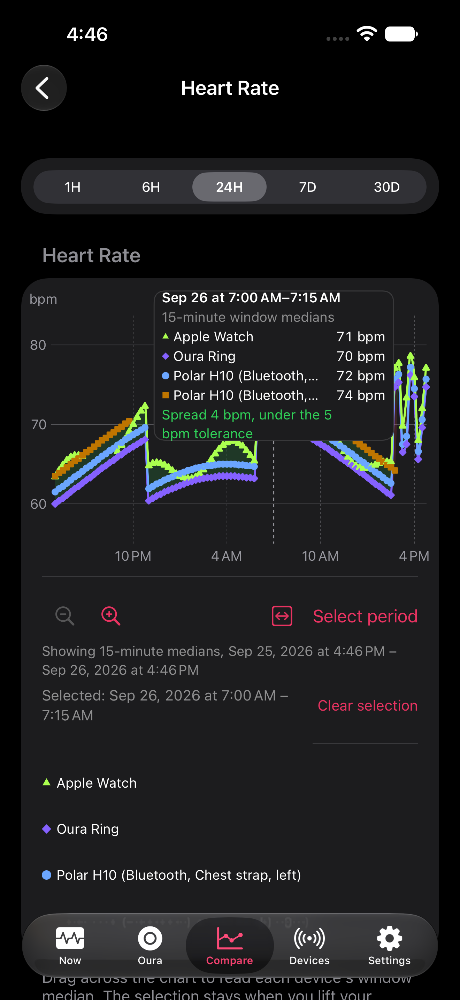
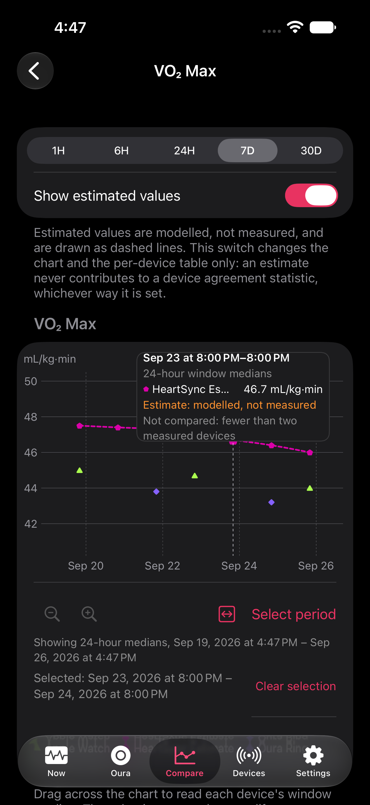

# Chart tooltip rendering

Synthetic chart-gallery captures on iOS 27.0, iPhone 17 Pro Max simulator. The
before capture uses the original material background; the after capture uses
`HeartSyncTheme.Chart.calloutBackground`. The fixtures are relative to launch
time, so timestamps and the selected window can differ between runs.

| Before | After |
| --- | --- |
|  |  |

`testChartGalleryScreenshots` retains selected Heart Rate, sparse VO₂ Max, and
both pairwise chart screenshots in the test result. The Oura chart UI test also
retains selected heart-rate, sleep-stage, and movement callouts. These are visual
review attachments, not automated pixel-difference assertions.

No user health data or live service accounts are used. Physical-device rendering
still needs confirmation on a signed build.

Dark appearance with the simulator's `extra-large` preferred text size:

| Heart Rate | Sparse VO₂ Max |
| --- | --- |
|  |  |

## Verification

- Built the `HeartSyncChecker` scheme and its test bundles with Xcode 27.1, signing disabled.
- Executed 55 Swift Testing cases: `MetricDetailSelectionTests`, `PairwiseSnapshotTests`,
  `OuraChartTests`, `ChartZoomTests`, and `ChartGalleryFixtureTests`; all passed.
- Executed the chart gallery, Oura charts, pair-selection/clear, and metric zoom/period
  UI cases on iPhone 17 Pro Max / iOS 27.0. The final focused run passed three UI cases;
  the gallery's added edge-tap coordinate missed a data window. After restoring the
  verified metric coordinate, the gallery-only rerun passed. Pairwise selection starts
  at the first window and covers an edge callout without coordinate guessing.
- Inspected selected Heart Rate, sparse VO₂ Max, pairwise, and Oura captures in light
  and dark appearance. Dark captures use `extra-large` text. No material bands remain.
- The full local UI-suite attempt was interrupted and is not counted as a completed
  pass. Further iPad validation was omitted at the user's request. No physical-device
  validation was performed.
- Existing XCTest teardown actor-isolation and App Intents metadata warnings remain.

Result bundles for the final focused run and corrected gallery rerun were
`HeartSyncTooltip-Final-Focused.xcresult` and `HeartSyncTooltip-Final-Gallery.xcresult`.
